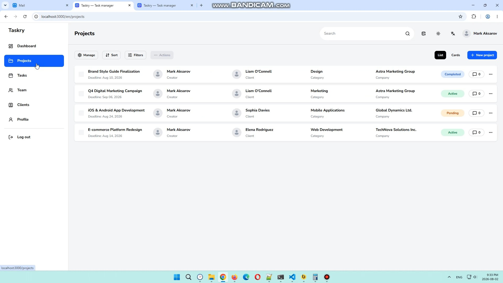
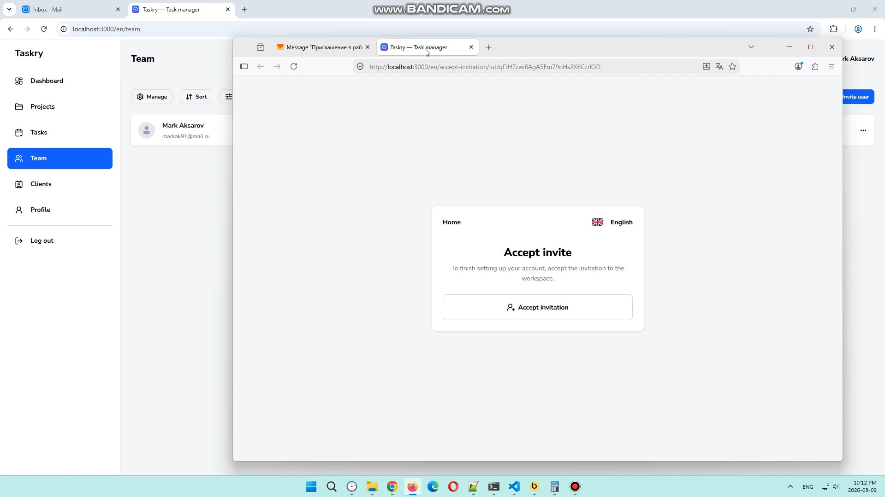
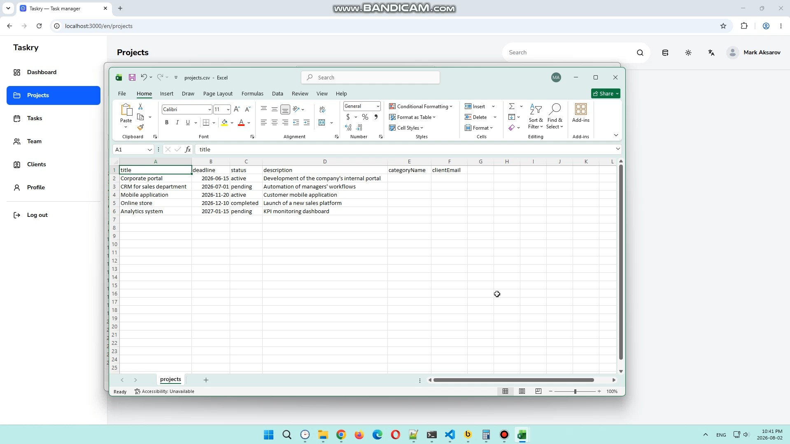
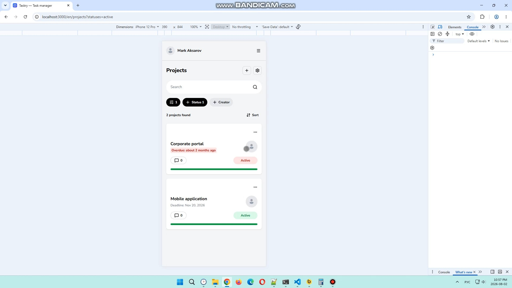

# Taskry

Taskry is a simple task management system. It helps you manage projects, tasks, clients, and team members with ease. You can create and organize projects with tasks, and break work into subtasks. The system also includes search, filtering, and sorting to quickly find what you need.

## Links

Taskry and its storybook are available at the links below.

- [Taskry](https://taskry.ru)
- [Storybook](https://storybook.taskry.ru)

## Quick guide

**Taskry** is a task management system that helps organize team workflows, track task progress, and store all important information in one place.

Main application features:

- Manage projects and tasks.
- Search and filter projects and tasks.
- Import and export data in CSV format.
- Invite users to the workspace for collaboration.
- Manage users, customers, companies, categories, and positions.

### Quick start

To start working with the application, follow a few simple steps:

1. Register in the system.
2. Confirm your email address.
3. Create a workspace.
4. Fill it with demo data.
5. Use the main application features.

The following video covers the main steps to get started with the application.

[](https://youtu.be/T7ozM0Beh-g)

### Inviting users

To invite a colleague or partner to your workspace:

1. Open the **Team** page.
2. Click the **Invite user** button.
3. Enter the email address.
4. Send the invitation.

The recipient must accept the invitation from the email, then complete registration or sign in with an existing account. After confirming access, the user automatically becomes a member of the workspace.

Important: users cannot be imported as regular data. They must be invited via email.

The following video shows the user invitation process.

[](https://youtu.be/9GMsusbQDmY)

### Working with data

The system supports data import and export. You can transfer and manage:

- Tasks and task categories.
- Projects and project categories.
- Customers and companies.
- Positions.

User import is not supported — users are added through the email invitation mechanism.

In addition to import and export, data can be edited directly through application forms:

- Create, edit, and delete tasks.
- Create, edit, and delete projects.
- Add comments.

The following video shows the data import process and adding information through application forms.

[](https://youtu.be/3m3HrpccU_M)

### Mobile version

The application has a responsive interface and supports devices with different screen sizes. The mobile version has some functional differences compared to the desktop version, which are designed to improve the user experience.

[](https://youtu.be/QKSiIqg2bpI)

## Tech Stack

| Category                 | Technologies                                                   |
| ------------------------ | -------------------------------------------------------------- |
| **Core**                 | TypeScript, Next.js, React                                     |
| **UI & Styling**         | Tailwind CSS, React Aria, Storybook, lucide-react, next-themes |
| **Database**             | Prisma ORM, PostgreSQL                                         |
| **Data Fetching**        | SWR                                                            |
| **Authentication**       | Better Auth                                                    |
| **Validation**           | Zod                                                            |
| **Internationalization** | next-intl                                                      |
| **Testing & Quality**    | Vitest, React Testing Library, ESLint                          |
| **Services**             | AWS SDK                                                        |
| **Communication**        | Nodemailer                                                     |
| **Containerization**     | Docker                                                         |

## Getting Started

### Development

Copy the `.env.development.example` to `.env.development` (which will be ignored by Git) and configure the required environment variables.

Run the following commands to install packages, apply the migrations and seed the database.

```
npm install
npm run migrate:dev
npm run prisma-generate:dev
npm run seed:dev
```

Run the development server:

```
npm run dev
```

Run storybook:

```
npm run storybook
```

Open http://localhost:3000 with your browser to see the result.

### Production

Copy the `.env.production.example` to `.env.production` (which will be ignored by Git) and configure the required environment variables.

To deploy the app in production, you need to build the database and application images, start the required containers, and initialize the database with migrations and seed data.

```bash
# Start PostgreSQL database container
docker compose -f docker-compose.production.yml up --build -d postgres_db

# Run database initialization (migrations + seed data)
docker compose -f docker-compose.production.yml up --build -d db_init

# Start application container
docker compose -f docker-compose.production.yml up --build -d app
```

## Storybook

### Development

This command starts the local development server and automatically open the address in a new browser window.

```
npm run storybook
```

### Production

This command builds the Storybook image and starts it in a docker container

```bash
docker compose -f docker-compose.production.yml up --build -d storybook
```

## Testing

The project includes several types of tests: UI tests, end-to-end tests, and integration tests.

### UI tests

Runs fast component-level and UI tests.

```
npm run test:ui
```

### End-to-end tests

Copy the `.env.e2e.example` to `.env.e2e` (which will be ignored by Git) and configure the required environment variables.

Starts required docker services, prepares the database, runs the dev server, and opens Cypress UI.

```
npm run test:e2e
```

Runs the same E2E tests in CI mode without UI.

```
npm run test:e2e:headless
```

### Integration tests

Copy the `.env.integration.example` to `.env.integration` (which will be ignored by Git) and configure the required environment variables.

Runs integration tests using a separate environment and database setup.

```
npm run test:integration
```

## Environment Variables

Your `.env.development`, `.env.production`, `.env.e2e`, or `.env.integration` file should look like this:

| Variable             | Description                                                                                                 |
| -------------------- | ----------------------------------------------------------------------------------------------------------- |
| `POSTGRES_USER`      | PostgreSQL username used by the docker container. See https://hub.docker.com/_/postgres#postgres_user       |
| `POSTGRES_PASSWORD`  | PostgreSQL password used by the docker container. See https://hub.docker.com/_/postgres#postgres_password   |
| `POSTGRES_DB`        | PostgreSQL database name created by the docker container. See https://hub.docker.com/_/postgres#postgres_db |
| `DATABASE_URL`       | PostgreSQL connection string used by prisma ORM.                                                            |
| `BETTER_AUTH_SECRET` | Secret key value by better-auth. See https://better-auth.com/docs/installation#set-environment-variables    |
| `BETTER_AUTH_URL`    | Base application URL used by better-auth.                                                                   |
| `SMTP_HOST`          | SMTP server hostname or IP address. See https://nodemailer.com/smtp#general-options                         |
| `SMTP_PORT`          | SMTP server port number. See https://nodemailer.com/smtp#general-options                                    |
| `SMTP_SECURE`        | Use TLS on connect (true for 465, otherwise STARTTLS). See https://nodemailer.com/smtp#general-options      |
| `SMTP_USER`          | SMTP auth username. See https://nodemailer.com/smtp#login                                                   |
| `SMTP_PASS`          | SMTP auth password. See https://nodemailer.com/smtp#login                                                   |
| `S3_ACCESS_KEY`      | AWS access key ID.                                                                                          |
| `S3_SECRET_KEY`      | AWS secret access key.                                                                                      |
| `S3_BUCKET`          | AWS S3 bucket name.                                                                                         |
| `S3_REGION`          | AWS S3 region.                                                                                              |
| `S3_ENDPOINT`        | Full URL of a custom S3-compatible endpoint                                                                 |

## Project Structure

```
├── app/                                 # Locale-based routing
│   ├── [locale]/
│   │   ├── (auth)/                      # Authentication routes
│   │   ├── (dashboard)/                 # Dashboard routes
│   │   ├── (site)/                      # Landing page and documentation routes
│   │   ├── [...rest]                    # Catch-all route for unknown routes within [locale]
│   │   └── layout.tsx
│   ├── api/                             # Route Handlers
│   └── globals.css
├── auth/                                # Auth components
├── common/                              # Shared components
├── cypress/                             # e2e tests
├── dashboard/                           # Dashboard components
├── i18n/                                # next-intl configuration files
├── icons/                               # Icon components
├── markdown/                            # Markdown content for documentation, privacy policy, and terms of service
├── messages/                            # JSON translation files for all locales (en, ru)
├── mocks/                               # Mock data for Storybook
├── lib/
│   ├── actions/                         # Server Actions
│   ├── data/                            # Data Access Layer (DAL) and DTO models
│   ├── hooks/                           # Custom hooks
│   ├── schemas/                         # Validation schemas (Zod)
│   ├── swr/                             # SWR hooks for data fetching
│   ├── utils/                           # Util functions
│   ├── auth-client.ts                   # Better Auth client instance
│   ├── auth.ts                          # Better Auth server configuration
│   ├── mail.ts                          # Nodemailer configuration for sending emails
│   ├── permissions.ts                   # Roles and permissions
│   ├── prisma.ts                        # Prisma Client initialization
│   └── types.ts                         # Types for filtering, sorting, and contexts
├── prisma/                              # Prisma schema, migrations, and seed data
├── site/                                # Landing page and documentation components
├── ui/                                  # UI kit components
├── public/                              # Static assets
├── .env.development.example             # Env variables for development
├── .env.e2e.example                     # Env variables for e2e tests
├── .env.integration.example             # Env variables for integration tests
├── .env.production.example              # Env variables for production
├── cypress.config.ts
├── docker-compose.e2e.yml               # Docker Compose for e2e tests
├── docker-compose.integration.yml       # Docker Compose for integration tests
├── docker-compose.production.yml        # Docker Compose for production
├── Dockerfile                           # Dockerfile for app
├── Dockerfile.dbinit                    # Dockerfile for database initialization
├── Dockerfile.storybook                 # Dockerfile for Storybook
├── middleware.ts
├── next.config.ts
├── prisma.config.ts
├── vitest.config.ts
├── vitest.setup.integration.ts          # Vitest setup for integration tests
└── vitest.setup.ui.ts                   # Vitest setup for UI tests
```

## License

This project is licensed under the **MIT License**. See [LICENSE](LICENSE).
